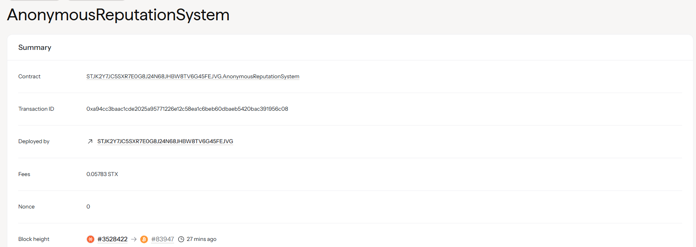

# Anonymous Reputation System

## Project Description

The Anonymous Reputation System is a blockchain-based solution that enables users to build and verify reputation scores while maintaining complete privacy through cryptographic proofs and zero-knowledge commitments. This system allows participants to prove their reputation without revealing their identity or specific transaction history, creating a trustless environment for reputation-based interactions.

The system utilizes cryptographic commitments and hash-based proofs to ensure that reputation scores are authentic while keeping user identities completely anonymous. Users submit cryptographic commitments of their reputation data, which can later be verified and aggregated without exposing personal information.

## Project Vision

Our vision is to create a decentralized reputation infrastructure that solves the privacy-trust paradox in digital interactions. We aim to enable:

- **Privacy-First Reputation**: Allow users to build and leverage reputation without sacrificing personal privacy
- **Trustless Verification**: Enable reputation verification without relying on centralized authorities
- **Cross-Platform Compatibility**: Create a universal reputation system that works across different platforms and services
- **Fraud Prevention**: Use cryptographic proofs to prevent reputation manipulation and gaming
- **Democratic Governance**: Implement community-driven reputation standards and thresholds

## Future Scope

### Phase 1: Core Implementation (Current)
- ✅ Basic cryptographic commitment system
- ✅ Anonymous reputation submission
- ✅ Reputation verification and aggregation
- ✅ Privacy-preserving score calculation

### Phase 2: Advanced Cryptography
- 🔄 Zero-knowledge proof integration (zk-SNARKs/zk-STARKs)
- 🔄 Ring signature implementation for enhanced anonymity
- 🔄 Merkle tree-based proof systems
- 🔄 Homomorphic encryption for private computations

### Phase 3: Ecosystem Integration
- 📋 Cross-chain reputation bridging
- 📋 API development for third-party integration
- 📋 Reputation decay and time-based scoring
- 📋 Multi-factor reputation metrics (activity, stake, community votes)

### Phase 4: Advanced Features
- 📋 Reputation-based governance mechanisms
- 📋 Anonymous credential system
- 📋 Reputation insurance and staking mechanisms
- 📋 Machine learning integration for fraud detection

### Phase 5: Scalability & Adoption
- 📋 Layer 2 scaling solutions
- 📋 Mobile SDK development
- 📋 Enterprise integration tools
- 📋 Compliance frameworks for regulated industries

## Key Features

### Current Implementation
- **Anonymous Commitment Submission**: Users can submit cryptographic commitments of their reputation scores
- **Privacy-Preserving Verification**: Aggregate and verify reputation without revealing individual identities
- **Cryptographic Proofs**: Ensure authenticity of reputation claims through cryptographic validation
- **Threshold-Based Verification**: Set minimum reputation thresholds for various use cases

### Upcoming Features
- **Zero-Knowledge Proofs**: Advanced cryptographic proofs for enhanced privacy
- **Reputation Staking**: Stake tokens to back reputation claims
- **Time-Decay Mechanics**: Reputation scores that evolve over time
- **Multi-Signature Verification**: Community-based reputation validation

## Technical Architecture

```
┌─────────────────┐    ┌──────────────────┐    ┌─────────────────┐
│   User Client   │    │   Smart Contract │    │   Verification  │
│                 │    │                  │    │     System      │
│ • Generate Keys │───▶│ • Store Commits  │───▶│ • Aggregate     │
│ • Create Proofs │    │ • Verify Proofs  │    │ • Validate      │
│ • Submit Claims │    │ • Manage State   │    │ • Report        │
└─────────────────┘    └──────────────────┘    └─────────────────┘
```

## Usage Examples

### Submit Anonymous Reputation
```clarity
(contract-call? .anonymous-reputation submit-reputation-commitment
  0x1234567890abcdef... ;; commitment hash
  100                  ;; reputation score
  0xdeadbeef...       ;; cryptographic proof
)
```

### Verify Reputation Threshold
```clarity
(contract-call? .anonymous-reputation verify-and-aggregate-reputation
  (list 0x123... 0x456... 0x789...) ;; commitment hashes
  50                                 ;; verification threshold
)
```

## Security Considerations

- **Cryptographic Security**: All reputation commitments use SHA-256 hashing
- **Privacy Protection**: No personal identifiable information is stored on-chain
- **Proof Validation**: Comprehensive validation of cryptographic proofs
- **Replay Protection**: Timestamp-based protection against replay attacks

## Contributing

We welcome contributions to the Anonymous Reputation System! Please refer to our contribution guidelines and code of conduct.

## License

This project is licensed under the MIT License - see the LICENSE file for details.

## Contract Address Details

Contract ID: 
STJK2Y7JC5SXR7E0G8J24N68JHBW8TV6G45FEJVG.AnonymousReputationSystem


---
## FAQ

### General Questions

**Q: How does the system maintain anonymity while building reputation?**
A: The system uses cryptographic commitments and hash-based proofs. Users generate cryptographic hashes of their reputation data without revealing their actual identity. The blockchain stores only these hashes, making it impossible to trace back to individual users.

**Q: Can reputation scores be manipulated or gamed?**
A: The system uses multiple layers of protection including cryptographic proofs, timestamp validation, and threshold-based verification. Future implementations will include staking mechanisms and community validation to further prevent gaming.

**Q: What happens if I lose my private keys?**
A: Since the system is designed for anonymity, lost keys cannot be recovered through traditional means. We recommend secure key backup strategies and will implement key rotation mechanisms in future versions.

**Q: How is reputation aggregated without revealing individual scores?**
A: The system uses cryptographic aggregation techniques that can compute collective reputation metrics without exposing individual contributions. This is achieved through homomorphic properties of the commitment scheme.

**Q: Is the system compatible with existing blockchain networks?**
A: Currently implemented on Stacks blockchain with Clarity smart contracts. Phase 3 development includes cross-chain bridging to enable compatibility with Ethereum, Bitcoin, and other major blockchains.

---
## Contributing

We welcome contributions to the Anonymous Reputation System! Please refer to our contribution guidelines and code of conduct.

## License

This project is licensed under the MIT License - see the LICENSE file for details.
